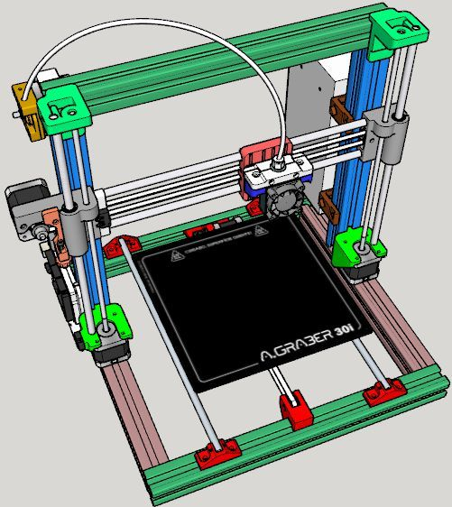

# AGraber 30i
 Projeto AGraber 30i

## Lista de peças

| Quantidade | Unidade | Descrição | Observação | Referência
| --- | --- | --- | --- | --- |
| 30 | un. | Parafusos M5x10mm | | |
| 30 | un. | Porcas Martelo para Perfil 3030 |  |  |
| 13 | un. | Porca Sextavada M3 NyLock |  |  |
| 2 | un. | Arruelas Lisas M4 |  |  |
| 3 | un. | Parafusos Allen M3x6mm |  |  |
| 3 | un. | Parafusos Allen M3x8mm |  |  |
| 18 | un. | Parafusos Allen M3x10mm |  |  |
| 5 | un. | Parafusos Allen M3x12mm |  |  |
| 17 | un. | Parafusos Allen M3x16mm |  |  |
| 20 | un. | Parafusos Allen M3x20mm |  |  |
| 14 | un. | Parafusos Allen M3x25mm |  |  |
| 2 | un. | Parafusos Allen M3x30mm |  |  |
| 1 | un. | Parafuso Allen M3 x 35mm |  |  |
| 15 | un. | Porcas Sextavadas M3 |  |  |
| 35 | un. | Arruelas Lisas M3 |  |  |
| 2 | un. | Arruelas Lisas 1/8" | Carro X, não deixar a correia escapar do carro |  |
| 2 | un. | Imãs Neodimio Redondo 4x2 |  |  |
| 4 | un. | Molas  8 voltas, 6mm diâmetro, 16mm de altura | Suspensão da Mesa Aquecida |  |
| 1 | un. | Extrusora Movtech | Opcional | [link](http://movtech.commercesuite.com.br/pecas/extrusora-direta-para-filamento-de-1-75-mm) |
| 4 | un. | Motores de Passo Nema 17 | Minimo de 3,5 Kgf.cm² e 1,0A. IDEAL  4,0 Kgf.cm² x 1,2A ou 1,7A |  |
| 1 | un. | Motor de Passo Nema 17 | Mínimo de 4,0 Kgf.cm² e 1,0A. Usado na Extrusora. |  |
| 2 | un. | Polias 20 dentes para correia GT2 de 6mm | Para motores do X e do Y |  |
| 2 | metros | Correia GT2 | Alma de fibra de vidro |  |
| 2 | un. | Polias tensoras GT2 de 20 dentes |  | [link](https://drive.google.com/file/d/1bXyFb1ZX8IkSU3b9ArEZUrr9N2AHh8Xp/view?usp=sharing) |
| 12 | un. | Rolamentos Lineares LM8UU |  |  |
| 2 | un. | Fuso Trapezoidal TR8 300mm passo 2 ou 4 |  |  |
| 2 | un. | Castanhas em Latão para Fuso TR8 passo 2 ou 4 |  |  |
| 2 | un. | Acoplador Rigido 5mmx8mm |  | [link](https://drive.google.com/file/d/1EUii7QB27qDGHcbwsaBblk0aZYnUJjxj/view?usp=sharing) |
| 2 | un. | Guia lisa, redonda, temperada, retificada, cromada 8mm x 320mm | Eixo Z |  |
| 2 | un. | Guia lisa, redonda, temperada, retificada, cromada 8mm x 340mm | Eixo Y |  |
| 2 | un. | Guia lisa, redonda, temperada, retificada, cromada 8mm x 400mm | Eixo X |  |
| 1 | un. | HotEnd E3D V5 (ou V6) com Termistor e Cartucho Aquecedor |  | [link](https://files.e3d-online.com/Drawings/E3Dv5_Assembly_Manual.pdf) |
| 1 | un. | Termistor 100K para ser usado na Mesa |  |  |
| 1 | un. | Mesa Aquecida 12V x 11A Modelo MK2b |  |  |
| 3 | un. | Chave Micro Switch KW11-3Z-3 c/ Curva 3T 250V |  | [link](https://www.eletrodex.com.br/kw11-3z-chave-micro-switch-5a.html) |
| 1 | un. | Microinterruptor de Ação Rápida 3A (BAL) |  | [link](https://www.eletrodex.com.br/chave-micro-switch-kw10b-com-haste.html) |
| 1 | un. | Servomotor SG90 9G |  | [link](https://www.eletrodex.com.br/motor-micro-servo-9g-sg90.html) |
| 1 | un. | Fonte 12V x 30A |  |  |
| 1 | un. | Placa controladora MKS E3D |  | [link](https://docs.google.com/document/d/1ZxwCf2RIq6IFCnWf0M5GBYYxGvryVqx1Z4gsOB5kWik/edit?usp=sharing) |
| 4 | un. | Drive de Motor de Passo TMC2208 ou TMC2209 ou TMC2225 |  | [link](https://docs.google.com/document/d/1ZxwCf2RIq6IFCnWf0M5GBYYxGvryVqx1Z4gsOB5kWik/edit?usp=sharing) |
| 1 | un. | LCD Mini 12864 RGB Neopixel |  |  |
| 1 | un. | Fan 40x40x10mm 12V | 5200 RPM ou 6000 RPM | [link](https://www.bottobrazil.com.br/dc-fan-40x40x10-mm) |
| 1 | un. | Fan 40x40x10mm 12V | 7000 RPM | [link](https://www.bottobrazil.com.br/dc-fan-40x40x10-mm) |
| 1 | un. | Cabo USB | Arduino <-> Computador |  |
| 1 | un. | Shield Módulo FET IRF520 |  | [link](https://drive.google.com/file/d/14vC7S0iVztOzO6d8JMr-301xOb8ngQ0q/view?usp=sharing) |
| 1 | metros | Fio Flexível 1mm² Vermelho | Fio de Conexão da Fonte ao Conector de 5A da Ramps |  |
| 1 | metros | Fio Flexível 1mm² Preto | Fio de Conexão da Fonte ao Conector de 5A da Ramps |  |
| 1 | metros | Fio Flexível 1,5mm² Vermelho | Fio de Conexão da Fonte ao Conector de 11A da Ramps | [link](https://www.eletrodex.com.br/cabinho-flexivel-1-50-mm-70-300v.html) |
| 1 | metros | Fio Flexível 1,5mm² Preto | Fio de Conexão da Fonte ao Conector de 11A da Ramps | [link](https://www.eletrodex.com.br/cabinho-flexivel-1-50-mm-70-300v.html) |
| 3 | metros | Fio Flexível 1,5mm² de Silicone para 200 °C | Fio de Conexão da Mesa à Ramps |  |
| 10 | metros | Flat AWG 26 de 6 vias | Fio para Conexões dos Fans, Microchaves fim de curso, Módulos, etc. | [link](https://www.eletrodex.com.br/cabo-flat-colorido-awg26.html) |
| 1 | un. | Cabo de Força 2P Paralelo 2x0,75mm² com 1,5m |  | [link](https://www.eletrodex.com.br/cabo-de-forca-rabicho-2pinos-paralelo-c-1-5m.html) |
| 100 | un. | Cinta Hellermann 2,5mmx100mm |  |  |
| 1 | KIT | PEÇAS IMPRESSAS PARA O PROJETO |  | [link](https://www.thingiverse.com/thing:3436936) |
| 1 | un. | Carro Y AGraber em alumínio ou ACM de 1/8" de espessura. |  | [link](https://www.thingiverse.com/thing:3436937) |